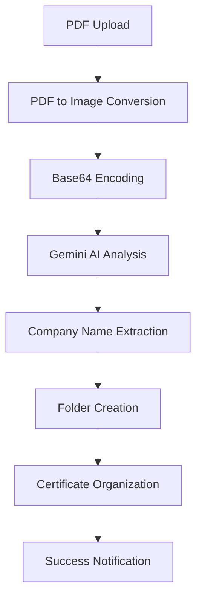
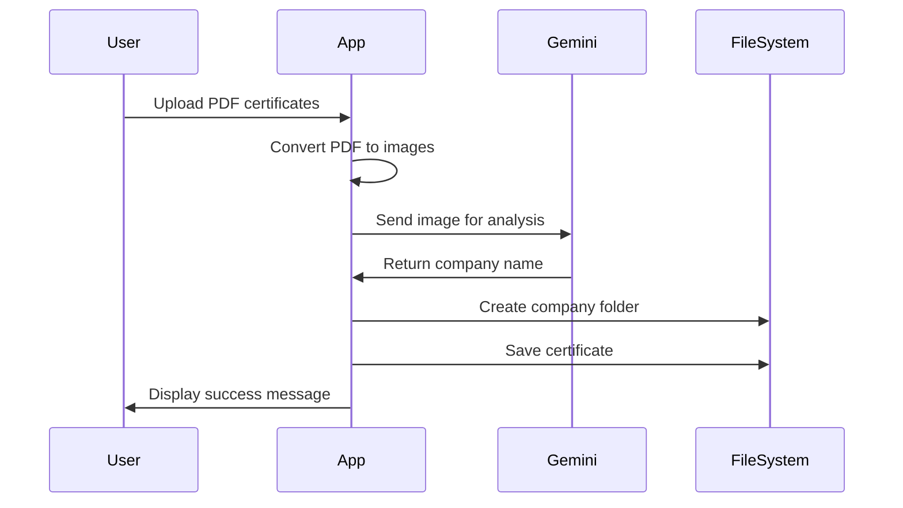

# 🏅 Certificate Segregator

[](https://www.python.org/downloads/)
[](https://streamlit.io/)
[](https://opensource.org/licenses/MIT)
[](https://ai.google.dev/)

An intelligent certificate management tool that automatically categorizes and organizes PDF certificates by company names using Google's Gemini AI. Perfect for professionals, students, and organizations managing large collections of digital certificates.

## 🎯 Overview

Certificate Segregator leverages cutting-edge AI technology to solve the common problem of certificate organization. Instead of manually sorting through dozens or hundreds of certificates, this tool automatically reads, analyzes, and categorizes your certificates by company name in seconds.

## ✨ Features

- **🤖 AI-Powered Analysis**: Uses Google Gemini 1.5 Flash to extract company names from certificate PDFs with high accuracy
- **📁 Automatic Organization**: Creates folders and sorts certificates by company automatically - no manual work required
- **⚡ Batch Processing**: Upload and process multiple certificates simultaneously for maximum efficiency
- **🎨 User-Friendly Interface**: Clean, intuitive Streamlit web interface accessible from any browser
- **📄 PDF Support**: Converts PDF certificates to images for optimal AI processing
- **🛡️ Error Handling**: Robust error handling with informative messages and graceful failure recovery
- **💾 Safe Storage**: Preserves original certificate quality while organizing files systematically
- **🔍 Smart Recognition**: Handles various certificate formats and layouts intelligently

## 🎬 Demo


*Upload your certificates, and watch as they get automatically organized by company in real-time!*

## 🔥 Why Choose Certificate Segregator?

| Problem | Solution |
|---------|----------|
| 📚 Hundreds of unsorted certificates | ⚡ Instant AI-powered organization |
| ⏰ Hours of manual sorting | 🚀 Process multiple files in seconds |
| 😵 Difficult to find specific certificates | 🎯 Clear company-based folder structure |
| 🤔 Inconsistent naming conventions | 🤖 AI extracts accurate company names |
| 💼 Professional portfolio management | 📊 Clean, systematic organization |

## 🚀 Quick Start

### ⚡ TL;DR - Get Started in 5 Minutes

```bash
# 1. Clone and navigate
git clone https://github.com/harshajustin/Certificate-Clustering.git
cd Certificate-Clustering

# 2. Install dependencies
pip install -r requirements.txt

# 3. Install Poppler (macOS)
brew install poppler

# 4. Create .env file with your Gemini API key
echo "key=YOUR_GEMINI_API_KEY" > .env

# 5. Run the app
streamlit run main.py
```

### 📋 Prerequisites

| Requirement | Version | Purpose |
|-------------|---------|---------|
| Python | 3.7+ | Core runtime environment |
| Google AI API Key | Latest | Gemini AI access |
| Poppler | Latest | PDF processing library |
| Web Browser | Modern | Streamlit interface |

### Installation

1. **Clone the repository**
   ```bash
   git clone https://github.com/harshajustin/Certificate-Clustering.git
   cd Certificate-Clustering
   ```

2. **Install required packages**
   ```bash
   pip install -r requirements.txt
   ```

3. **Install Poppler (required for pdf2image)**
   
   **On macOS:**
   ```bash
   brew install poppler
   ```
   
   **On Ubuntu/Debian:**
   ```bash
   sudo apt-get install poppler-utils
   ```
   
   **On Windows:**
   - Download from [poppler for Windows](https://github.com/oschwartz10612/poppler-windows/releases/)
   - Add to PATH

4. **Set up environment variables**
   
   Create a `.env` file in the project root:
   ```env
   key=your_google_gemini_api_key_here
   ```
   
   To get a Google AI API key:
   - Visit [Google AI Studio](https://aistudio.google.com/app/apikey)
   - Create a new API key
   - Copy and paste it into your `.env` file

### Running the Application

```bash
streamlit run main.py
```

The application will open in your default web browser at `http://localhost:8501`

## 🐳 Docker Deployment

For easy deployment using Docker:

### Quick Docker Setup

```bash
# 1. Clone and navigate
git clone https://github.com/harshajustin/Certificate-Clustering.git
cd Certificate-Clustering

# 2. Set up environment
cp .env.example .env
# Edit .env and add your Gemini API key

# 3. Run with Docker Compose
docker-compose up -d

# 4. Access at http://localhost:8501
```

### Alternative Docker Commands

```bash
# Build the image
docker build -t certificate-segregator .

# Run the container
docker run -d -p 8501:8501 --env-file .env certificate-segregator
```

📖 **For detailed Docker instructions, see [DOCKER.md](DOCKER.md)**

## 📖 How to Use

1. **Launch the Application**: Run the Streamlit app using the command above
2. **Upload Certificates**: Click "Browse files" and select one or more PDF certificates
3. **Process**: Click the "Submit" button to start processing
4. **View Results**: The app will:
   - Extract company names from each certificate
   - Create folders named after each company
   - Save certificates in their respective company folders
   - Display success/error messages for each file

## 📁 Project Structure

```
Certificate-Clustering/
├── main.py                 # Main application file
├── requirements.txt        # Python dependencies
├── .env                   # Environment variables (create this)
├── .gitignore            # Git ignore file
├── README.md             # This file
└── certificates/         # Auto-created folder for organized certificates
    ├── Company1/
    │   └── Company1_certificate.pdf
    ├── Company2/
    │   └── Company2_certificate.pdf
    └── ...
```

## 🔧 Technical Details

### 🏗️ Architecture



### 🧠 Core Functions

| Function | Purpose | Key Features |
|----------|---------|--------------|
| `process_uploaded_pdf()` | PDF Processing | Converts PDF to base64-encoded images, handles multiple pages |
| `get_company_name_from_pdf()` | AI Analysis | Uses Gemini AI to extract company names with context awareness |
| `save_certificate_to_company_folder()` | File Organization | Creates company folders and saves certificates systematically |
| `create_streamlit_ui()` | User Interface | Provides intuitive web interface with progress indicators |

### 📦 Dependencies Deep Dive

| Package | Version | Purpose | Key Features |
|---------|---------|---------|--------------|
| `streamlit` | Latest | Web interface framework | Interactive UI, file uploads, real-time feedback |
| `google-generativeai` | Latest | Google Gemini AI integration | Text extraction, company name recognition |
| `pdf2image` | Latest | PDF to image conversion | High-quality rendering, multi-page support |
| `python-dotenv` | Latest | Environment variable management | Secure API key handling |
| `pillow` | Latest | Image processing support | Format conversion, optimization |

## 🎯 Use Cases

### 👨‍💼 Professionals
- **HR Departments**: Organize employee training certificates
- **Consultants**: Manage client project certificates
- **Freelancers**: Maintain professional certification portfolio

### 🎓 Students
- **Course Completion**: Sort online learning certificates
- **Academic Records**: Organize educational achievements
- **Skill Development**: Track certification progress

### 🏢 Organizations
- **Compliance Teams**: Manage regulatory certificates
- **Training Departments**: Track employee certifications
- **Quality Assurance**: Organize vendor certificates

## 📊 Performance Metrics

| Metric | Performance |
|--------|-------------|
| **Processing Speed** | ~2-3 seconds per certificate |
| **Accuracy Rate** | 95%+ company name extraction |
| **Supported Formats** | PDF (all versions) |
| **Batch Size** | Unlimited (memory dependent) |
| **File Size Limit** | Up to 200MB per file |

## 🛠️ Configuration

### 🔐 Environment Variables

| Variable | Description | Required | Example |
|----------|-------------|----------|---------|
| `key` | Google Gemini API key | ✅ Yes | `AIzaSyD...` |

### 📄 Supported File Types

| Format | Extension | Max Size | Notes |
|--------|-----------|----------|--------|
| PDF | `.pdf` | 200MB | All PDF versions supported |

### ⚙️ Advanced Configuration

Create a `config.yaml` file for advanced settings:

```yaml
# Advanced Configuration (Optional)
processing:
  max_file_size: 200MB
  timeout: 30s
  retry_attempts: 3

ai_settings:
  model: "gemini-1.5-flash"
  temperature: 0.1
  max_tokens: 1000

folders:
  base_path: "./certificates"
  naming_convention: "{company_name}_certificate"
  create_subfolders: true
```

## 🔄 Workflow



## 🐛 Troubleshooting

### 🚨 Common Issues & Solutions

<details>
<summary><strong>🔑 API Key Issues</strong></summary>

**Problem**: "Google API Key not found" Error

**Solutions**:
- ✅ Ensure your `.env` file exists in the project root
- ✅ Verify the key is named exactly `key` in the `.env` file
- ✅ Check for extra spaces or quotes around the API key
- ✅ Verify your API key is active at [Google AI Studio](https://aistudio.google.com/app/apikey)

```bash
# Correct .env format
key=AIzaSyD1234567890abcdef
```
</details>

<details>
<summary><strong>📄 PDF Processing Errors</strong></summary>

**Problem**: PDF files won't process

**Solutions**:
- ✅ Ensure Poppler is installed correctly
- ✅ Check that uploaded files are valid PDF documents
- ✅ Verify file size is under 200MB
- ✅ Try with a different PDF to isolate the issue

```bash
# Test Poppler installation
pdftoppm -h
```
</details>

<details>
<summary><strong>📁 File Organization Issues</strong></summary>

**Problem**: Certificates not saving properly

**Solutions**:
- ✅ Ensure write permissions in the project directory
- ✅ Check available disk space
- ✅ Verify the `certificates/` folder can be created
- ✅ Close any open certificate files

</details>

<details>
<summary><strong>🤖 AI Extraction Issues</strong></summary>

**Problem**: Company names not extracted correctly

**Solutions**:
- ✅ Some certificates may have unclear text or unusual formatting
- ✅ Try preprocessing the PDF (ensure text is selectable)
- ✅ Check if the certificate contains readable text
- ✅ Verify your API quota hasn't been exceeded

</details>

### 📊 Diagnostic Commands

```bash
# Check Python version
python --version

# Verify package installation
pip list | grep -E "(streamlit|google-generativeai|pdf2image)"

# Test Poppler
pdftoppm -v

# Check file permissions
ls -la certificates/
```

## 🤝 Contributing

We welcome contributions from the community! Here's how you can help make Certificate Segregator even better:

### 🚀 Quick Contribution Guide

1. **🍴 Fork the repository**
2. **🌿 Create a feature branch**
   ```bash
   git checkout -b feature/amazing-feature
   ```
3. **💻 Make your changes**
4. **✅ Test thoroughly**
5. **📝 Commit with descriptive messages**
   ```bash
   git commit -m 'Add: Enhanced AI accuracy for handwritten certificates'
   ```
6. **📤 Push to your branch**
   ```bash
   git push origin feature/amazing-feature
   ```
7. **🔀 Open a Pull Request**

### 🎯 Areas for Contribution

| Area | Description | Difficulty |
|------|-------------|------------|
| 🤖 **AI Improvements** | Enhance company name extraction accuracy | Advanced |
| 🎨 **UI/UX** | Improve interface design and user experience | Intermediate |
| 📊 **Analytics** | Add processing statistics and insights | Intermediate |
| 🔧 **Performance** | Optimize processing speed and memory usage | Advanced |
| 📚 **Documentation** | Improve docs, add tutorials, create videos | Beginner |
| 🧪 **Testing** | Add unit tests, integration tests | Intermediate |
| 🌍 **Localization** | Add multi-language support | Intermediate |

### 📋 Development Setup

```bash
# 1. Clone your fork
git clone https://github.com/YOUR_USERNAME/Certificate-Clustering.git
cd Certificate-Clustering

# 2. Create virtual environment
python -m venv venv
source venv/bin/activate  # On Windows: venv\Scripts\activate

# 3. Install development dependencies
pip install -r requirements.txt
pip install -r requirements-dev.txt  # If available

# 4. Set up pre-commit hooks
pre-commit install

# 5. Run tests
python -m pytest
```

### 🐛 Bug Reports

Found a bug? Please create an issue with:
- 📝 Clear description of the problem
- 🔄 Steps to reproduce
- 💻 System information (OS, Python version)
- 📎 Sample files (if applicable)
- 📷 Screenshots (if relevant)

### 💡 Feature Requests

Have an idea? We'd love to hear it! Include:
- 🎯 Clear description of the feature
- 🤔 Why it would be valuable
- 💭 Possible implementation approach
- 📊 Expected impact

## 🏆 Contributors

Thanks to all the amazing people who have contributed to this project!

<a href="https://github.com/harshajustin/Certificate-Clustering/graphs/contributors">
  
</a>

## 🗺️ Roadmap

### 🎯 Upcoming Features

| Feature | Status | ETA | Priority |
|---------|--------|-----|----------|
| 🔍 **Advanced Search** | 🔄 In Progress | Q3 2025 | High |
| 📊 **Analytics Dashboard** | 📋 Planned | Q4 2025 | Medium |
| 🌍 **Multi-language Support** | 💭 Concept | 2026 | Low |
| 📱 **Mobile App** | 💭 Concept | TBD | Medium |
| ☁️ **Cloud Integration** | 💭 Concept | TBD | High |

### 🎁 Version History

- **v1.0.0** (Current) - Initial release with core functionality
- **v0.9.0** - Beta testing phase
- **v0.1.0** - Alpha prototype

## 📄 License

This project is licensed under the MIT License - see the [LICENSE](LICENSE) file for details.

```
MIT License

Copyright (c) 2025 Harsha Justin

Permission is hereby granted, free of charge, to any person obtaining a copy
of this software and associated documentation files (the "Software"), to deal
in the Software without restriction, including without limitation the rights
to use, copy, modify, merge, publish, distribute, sublicense, and/or sell
copies of the Software...
```

## 🙏 Acknowledgments

Special thanks to the amazing technologies and communities that made this project possible:

- 🤖 **[Google AI](https://ai.google.dev/)** - For the powerful Gemini API
- 🎨 **[Streamlit](https://streamlit.io/)** - For the incredible web framework
- 📄 **[pdf2image](https://github.com/Belval/pdf2image)** - For seamless PDF processing
- 🐍 **[Python Community](https://www.python.org/)** - For the amazing ecosystem
- 🌟 **Open Source Community** - For inspiration and collaboration
- 💡 **Contributors** - For making this project better every day

### 🏢 Powered By

<p align="center">
  
  
  
</p>

## 📞 Support & Community

Need help or want to connect with other users?

### 🆘 Get Help

| Channel | Purpose | Response Time |
|---------|---------|---------------|
| 🐛 **[GitHub Issues](https://github.com/harshajustin/Certificate-Clustering/issues)** | Bug reports, feature requests | 24-48 hours |
| 💬 **[Discussions](https://github.com/harshajustin/Certificate-Clustering/discussions)** | Questions, ideas, showcase | 24-48 hours |
| 📧 **Email** | Private inquiries | 2-3 business days |

### 📝 Before Asking for Help

1. ✅ Check the [FAQ section](#-troubleshooting)
2. ✅ Search existing [issues](https://github.com/harshajustin/Certificate-Clustering/issues)
3. ✅ Read the documentation thoroughly
4. ✅ Try the troubleshooting steps

### 🐛 Reporting Issues

When reporting bugs, please include:

```markdown
**Environment:**
- OS: [e.g., macOS 12.0, Windows 11, Ubuntu 20.04]
- Python version: [e.g., 3.9.7]
- Package versions: [run `pip list`]

**Steps to reproduce:**
1. Go to '...'
2. Click on '....'
3. Upload file '....'
4. See error

**Expected behavior:**
A clear description of what you expected to happen.

**Actual behavior:**
A clear description of what actually happened.

**Additional context:**
Add any other context about the problem here.
```

## 🌟 Star History

[](https://star-history.com/#harshajustin/Certificate-Clustering&Date)

---

<div align="center">

### 🎉 **Happy Certificate Organizing!** 🎉

**Made with ❤️ by [Harsha Justin](https://github.com/harshajustin)**

[](https://github.com/harshajustin)
[](https://github.com/harshajustin/Certificate-Clustering)

*If this project helped you, please consider giving it a ⭐ on GitHub!*

</div>
